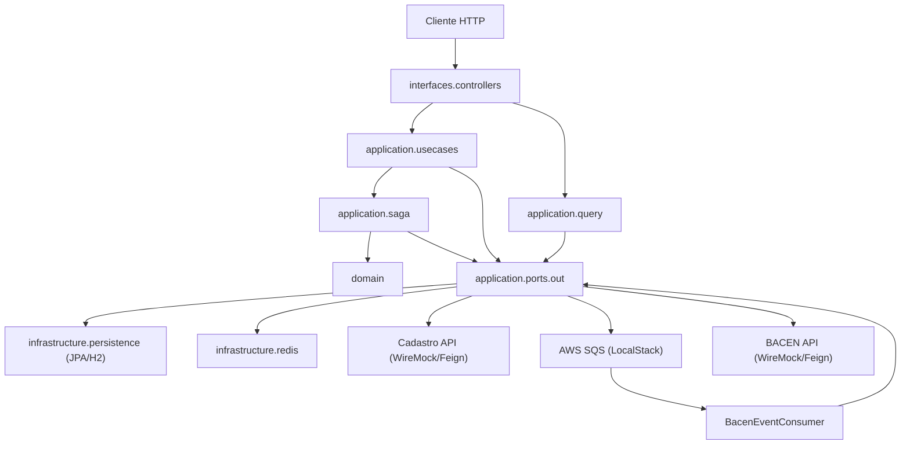

# Transfer API — Desafio Técnico

API REST para **Consulta de Saldo** e **Transferência entre Contas**, desenvolvida em Java 21 + Spring Boot 3.3.2.

Arquitetura Hexagonal (Ports & Adapters) com padrão SAGA orquestrado, Redis para cache/estado efêmero e AWS SQS para
notificação assíncrona ao BACEN.

---

## Pré-requisitos

| Ferramenta              | Versão mínima |
|-------------------------|---------------|
| Docker + Docker Compose | 24+           |
| Java                    | 21            |
| Maven                   | 3.9+          |

---

## Como rodar

### 1. Subir a infraestrutura completa (recomendado)

```bash
docker-compose up --build
```

Isso sobe:

- **App** na porta `8080`
- **Redis** na porta `6379`
- **LocalStack (SQS)** na porta `4566`
- **WireMock — Cadastro API** na porta `8081`
- **WireMock — BACEN API** na porta `8082`

### 2. Rodar apenas a infraestrutura e subir a app localmente

```bash
# Apenas dependências
docker-compose up redis ministack ministack-setup cadastro-mock bacen-mock

# App com H2 em memória (sem Postgres/Redis externos)
mvn spring-boot:run
```

> Por padrão, a app usa H2 em memória, Redis em `localhost:6379` e LocalStack em `localhost:4566`.

### 3. Rodar os testes

```bash
# Executar sem o relatório de cobertura
mvn test
```

```bash
# Executar com relatório de cobertura (JaCoCo)
# Relatório gerado em: target/site/jacoco/index.html
# Requisito mínimo configurado: 80% de cobertura de linhas nos pacotes application.* e domain.*.
mvn verify
```

---

## Endpoints

### `GET /v1/accounts/{accountId}/balance` — Consulta de Saldo

Retorna o saldo atual e limite diário da conta. Valida se a conta está ativa e busca o nome do cliente na API de
Cadastro.

**Request:**

```
GET /v1/accounts/acc-origin-001/balance
```

**Response 200 OK:**

```json
{
  "accountId": "acc-origin-001",
  "customerName": "Victor Lima",
  "balance": 1500.0,
  "availableLimit": 1000.0,
  "dailyLimitUsed": 0.0,
  "dailyLimitRemaining": 1000.0,
  "updatedAt": "2026-05-08T12:00:00"
}
```

**Erros:**

| Código HTTP | Código de erro      | Descrição               |
|-------------|---------------------|-------------------------|
| 422         | `ACCOUNT_INACTIVE`  | Conta inativa ou bloqueada |
| 422         | `ENTITY_NOT_FOUND`  | Conta não encontrada    |

---

### `POST /v1/transfers` — Transferência entre Contas

Executa uma transferência. Requer header `Idempotency-Key` único por operação para garantir idempotência.

**Headers:**

```
Idempotency-Key: <uuid>
Content-Type: application/json
```

**Request Body:**

```json
{
  "originAccountId": "acc-origin-001",
  "destinationAccountId": "acc-dest-001",
  "amount": 200.0,
  "description": "Pagamento de serviço"
}
```

**Response 202 Accepted:**

```json
{
  "transferId": "3fa85f64-5717-4562-b3fc-2c963f66afa6",
  "status": "PROCESSING",
  "amount": 200.0,
  "originAccountId": "acc-origin-001",
  "destinationAccountId": "acc-dest-001",
  "createdAt": "2026-05-08T12:00:00"
}
```

**Erros:**

| Código HTTP | Código de erro                 | Descrição                                   |
|-------------|--------------------------------|---------------------------------------------|
| 400         | `MISSING_IDEMPOTENCY_KEY`      | Header obrigatório ausente                  |
| 400         | `VALIDATION_ERROR`             | Campos inválidos (amount ≤ 0, campos nulos) |
| 422         | `ACCOUNT_INACTIVE`             | Conta inativa ou bloqueada                  |
| 422         | `INSUFFICIENT_BALANCE`         | Saldo insuficiente na conta de origem       |
| 422         | `DAILY_LIMIT_EXCEEDED`         | Limite diário de R$ 1.000,00 excedido       |
| 422         | `ENTITY_NOT_FOUND`             | Conta não encontrada                        |
| 502         | `EXTERNAL_SERVICE_UNAVAILABLE` | API de Cadastro ou BACEN indisponível       |

---

### `GET /v1/transfers/{transferId}` — Consulta de Status da Transferência

Consulta o status atual de uma transferência. Útil para confirmar a transição de `PROCESSING` → `COMPLETED` após a
notificação assíncrona ao BACEN.

**Request:**

```
GET /v1/transfers/3fa85f64-5717-4562-b3fc-2c963f66afa6
```

**Response 200 OK:**

```json
{
  "transferId": "3fa85f64-5717-4562-b3fc-2c963f66afa6",
  "status": "COMPLETED",
  "amount": 200.0,
  "originAccountId": "acc-origin-001",
  "destinationAccountId": "acc-dest-001",
  "createdAt": "2026-05-08T12:00:00"
}
```

**Status possíveis:** `PROCESSING` → `COMPLETED` | `FAILED` | `ROLLED_BACK`

---

## Decisão arquitetural: por que a notificação ao BACEN é assíncrona

O `POST /v1/transfers` retorna **imediatamente com status `PROCESSING`** após debitar/creditar as contas. A notificação
ao BACEN é processada de forma **assíncrona via fila SQS**.

**Fluxo:**

```
POST /v1/transfers
  └─► SAGA: valida → executa débito/crédito → publica evento SQS
         └─► [202 PROCESSING]

BacenEventConsumer (@Scheduled, 1s)
  └─► Lê SQS → chama BACEN API → marca Transfer = COMPLETED
```

**Por que esse design?**

- **Resiliência:** rate limit 429 do BACEN não reverte a transferência — a mensagem fica na fila e é re-entregue
  automaticamente (SQS visibility timeout)
- **DLQ:** após 3 falhas, a mensagem vai para `bacen-events-dlq` para inspeção e reprocessamento manual
- **Idempotência:** o consumer verifica `TransferStatus.COMPLETED` antes de notificar novamente

Para confirmar o status final, use `GET /v1/transfers/{transferId}`.

---

## Arquitetura

O Transfer Service foi organizado seguindo **Arquitetura Hexagonal**, **Clean Architecture** e princípios de **DDD**. A
ideia central é manter regras de negócio e fluxos de aplicação independentes de frameworks, banco, Redis, Feign ou AWS.

As dependências apontam para dentro:

```text
interfaces
    ↓
application
    ↓
domain

infrastructure
    ↑ implementa ports definidos pela application
```

Fluxo padrão de execução:

```text
Controller
  └─► UseCase / QueryUseCase
        └─► Application Port
              └─► Infrastructure Adapter
                    └─► JPA / Redis / Feign / SQS / API externa
```

### Estrutura de pacotes

```
interfaces/
  controllers/          ← Adaptadores de entrada HTTP (Spring MVC)
  dto/                  ← DTOs públicos da API REST

application/
  dto/                  ← DTOs internos da aplicação, independentes da camada HTTP
  ports/out/            ← Contratos de saída usados pelos casos de uso
  query/                ← Query Use Cases para endpoints de leitura
  usecases/             ← Casos de uso de comando/orquestração
  saga/                 ← Orquestração SAGA com compensação transacional
    steps/              ← Steps independentes e compensáveis

domain/
  entities/             ← Entidades de domínio puras (sem JPA/Spring)
  valueobjects/         ← Value Objects imutáveis, como Money
  exceptions/           ← Exceções semânticas de negócio

infrastructure/
  adapters/             ← Integrações externas via Feign + Resilience4j
  persistence/          ← Adapters JPA que implementam ports da aplicação
    entities/           ← Entidades JPA
    mappers/            ← Conversão JPA ↔ domínio
  redis/                ← Adapters Redis que implementam ports de cache/estado efêmero
  sqs/                  ← Publisher/Consumer SQS nas bordas da aplicação
  config/               ← Configuração de Redis, SQS, ObjectMapper
```

### Responsabilidades por camada

| Camada           | Responsabilidade                                                                     | Não deve conhecer                          |
|------------------|--------------------------------------------------------------------------------------|--------------------------------------------|
| `interfaces`     | HTTP, validação de request, status codes, DTOs públicos                              | JPA, Redis, Feign, AWS SDK, repositories   |
| `application`    | Orquestração, casos de uso, query use cases, SAGA, ports                             | Implementações concretas de infraestrutura |
| `domain`         | Entidades, invariantes, comportamento de negócio, value objects, exceções semânticas | Spring, JPA, Redis, Feign, HTTP            |
| `infrastructure` | Persistência, cache, mensageria, APIs externas, configurações técnicas               | Regras de apresentação                     |

### Ports & Adapters

A application define contratos de saída em `application/ports/out`. A infrastructure implementa esses contratos:

| Port                      | Implementação                                   | Responsabilidade                               |
|---------------------------|-------------------------------------------------|------------------------------------------------|
| `AccountPort`             | `infrastructure.persistence.AccountRepository`  | Busca e persistência de contas via JPA         |
| `TransferPort`            | `infrastructure.persistence.TransferRepository` | Busca e persistência de transferências via JPA |
| `BalanceCachePort`        | `BalanceCacheRepository`                        | Cache curto de consulta de saldo               |
| `DailyLimitPort`          | `DailyLimitRepository`                          | Controle atômico do limite diário              |
| `IdempotencyPort`         | `IdempotencyRepository`                         | Cache de respostas idempotentes                |
| `CustomerGateway`         | `CadastroApiAdapter`                            | Integração com API de Cadastro                 |
| `BacenNotificationPort`   | `BacenApiAdapter`                               | Notificação HTTP ao BACEN                      |
| `BacenEventPublisherPort` | `BacenEventPublisher`                           | Publicação de eventos no SQS                   |

Com isso, controllers e casos de uso não dependem de classes como `JpaRepository`, `StringRedisTemplate`, Feign clients
ou `SqsClient`.

### Command Use Cases e Query Use Cases

Endpoints de comando e leitura são separados:

| Endpoint                               | Tipo    | Entrada na application        |
|----------------------------------------|---------|-------------------------------|
| `POST /v1/transfers`                   | Command | `TransferUseCase`             |
| `GET /v1/transfers/{transferId}`       | Query   | `GetTransferByIdQueryUseCase` |
| `GET /v1/accounts/{accountId}/balance` | Query   | `GetBalanceQueryUseCase`      |

Essa separação evita controller consultando banco diretamente e deixa regras de leitura centralizadas na camada de
aplicação.

### Modelo de domínio

As entidades de domínio são puras:

- `Account` concentra comportamento de conta: `ensureActive`, `ensureSufficientBalance`, `debit`, `credit`.
- `Transfer` concentra criação e transições de estado: `start`, `markAs`.
- `Money` é um value object imutável e valida valor positivo com até duas casas decimais.
- Exceções como `AccountInactiveException`, `InsufficientBalanceException`, `DailyLimitExceededException`,
  `AccountNotFoundException` e `TransferNotFoundException` expressam falhas de negócio de forma semântica.

As anotações JPA ficam apenas em `infrastructure.persistence.entities`, e os mappers traduzem entre o modelo persistido
e o modelo de domínio.

### Visão da solução



---

## SAGA de Transferência

A transferência é executada em 5 steps com compensação automática em caso de falha:

| # | Step                    | O que faz                                                                                        | Compensação                      |
|---|-------------------------|--------------------------------------------------------------------------------------------------|----------------------------------|
| 1 | `ValidateAccountStep`   | Consulta contas via `AccountPort`. Valida status e saldo usando comportamento do domínio.        | —                                |
| 2 | `ValidateLimitStep`     | Incrementa o limite diário via `DailyLimitPort` e valida o teto de R$ 1.000,00.                  | Decremento via `DailyLimitPort`  |
| 3 | `FetchCustomerStep`     | Busca dados do cliente via `CustomerGateway`.                                                    | —                                |
| 4 | `ExecuteTransferStep`   | Bloqueia contas via `AccountPort`, executa debit/credit e persiste a transferência em transação. | Crédito/débito reverso           |
| 5 | `PublishBacenEventStep` | Publica `BacenTransferEvent` via `BacenEventPublisherPort`.                                      | — (SAGA sofre rollback completo) |

> Steps 2 e 3 executam **em paralelo** via virtual threads para reduzir latência.  
> Requisições rejeitadas (validações) **não geram escrita no banco** — o INSERT da transferência ocorre apenas após
> todas as validações passarem.

**Ordenação de locks:** `findAllByIdsWithLock` usa `ORDER BY id` para evitar deadlocks em transações concorrentes.

---

## Redis — Caches e Estado Efêmero

| Repositório               | Prefixo da chave             | TTL | Estratégia                                             |
|---------------------------|------------------------------|-----|--------------------------------------------------------|
| `IdempotencyRepository`   | `idempotency::`              | 24h | Write-aside no `TransferUseCase` via `IdempotencyPort` |
| `DailyLimitRepository`    | `limit::{accountId}::{data}` | 48h | Counter atômico (INCRBY/DECR em pipeline)              |
| `BalanceCacheRepository`  | `balance::`                  | 5s  | Read-through; evicção explícita pós-transferência      |
| `CustomerCacheRepository` | `customer::`                 | 60s | Read-through (cache da resposta da API de Cadastro)    |

---

## Padrões de resiliência

| Dependência  | Circuit Breaker             | Retry                     | Timeout    |
|--------------|-----------------------------|---------------------------|------------|
| API Cadastro | ✅ (slide=10, threshold=50%) | ✅ (2 tentativas, backoff) | ✅ 500ms/2s |
| BACEN API    | ✅ (slide=10, threshold=50%) | ✅ (3 tentativas, backoff) | ✅ 500ms/2s |

Rate limit 429 do BACEN → `BacenRateLimitException` → mensagem re-enfileirada no SQS (sem retry imediato pelo
Resilience4j, evitando agravar o rate limit).

---

## Observabilidade

| Endpoint                   | Descrição                          |
|----------------------------|------------------------------------|
| `GET /actuator/health`     | Status da aplicação e dependências |
| `GET /actuator/prometheus` | Métricas no formato Prometheus     |
| `GET /actuator/metrics`    | Métricas detalhadas                |

Distributed tracing via **Micrometer + Brave (Zipkin)**. Sampling padrão: 1% (
`management.tracing.sampling.probability=0.01`).  
Logs incluem `traceId` e `spanId` no padrão: `[traceId=...,spanId=...]`.

---

## Performance

- **Virtual Threads** habilitadas (`spring.threads.virtual.enabled=true`) — Tomcat e steps paralelos da SAGA rodam em
  virtual threads.
- **Tomcat:** max 400 threads, 10.000 conexões concorrentes, accept-count 200.
- **HikariCP:** pool de 10–50 conexões, timeout de 3s.
- **Feign HC5:** pool de 200 conexões (50/rota).
- **JPA batch:** inserts/updates em lotes de 20.

---

## Contas de teste (data.sql)

| ID                 | Status   | Saldo       |
|--------------------|----------|-------------|
| `acc-origin-001`   | ACTIVE   | R$ 1.500,00 |
| `acc-dest-001`     | ACTIVE   | R$ 500,00   |
| `acc-inactive-001` | INACTIVE | R$ 200,00   |
| `acc-blocked-001`  | BLOCKED  | R$ 300,00   |
