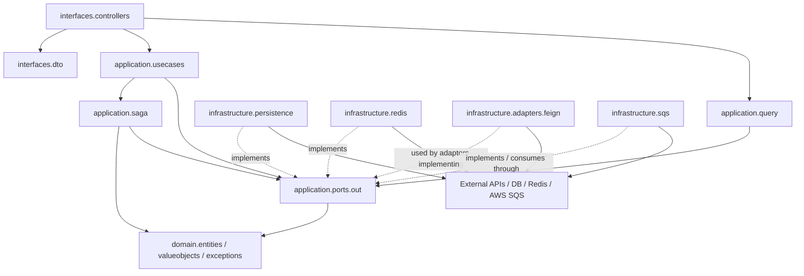

# ADR-02: Hexagonal Architecture Refactor

## Status

Accepted.

## Context

The Transfer Service mixed responsibilities across layers:

- REST controllers read and wrote directly through JPA and Redis repositories.
- Application use cases depended on infrastructure packages such as persistence, Redis, SQS, Feign adapters and adapter DTOs.
- Domain entities were also JPA entities, leaking persistence annotations into the domain model.
- Read endpoints reused command-oriented services or accessed persistence directly instead of explicit query use cases.
- SQS and external API details were visible from orchestration steps.

These violations made unit tests depend on Spring and concrete infrastructure, increased coupling, and made the dependency direction inconsistent with Hexagonal Architecture, Clean Architecture, DDD, Separation of Concerns and SOLID.

## Decision

The service now follows this dependency direction:

```text
interfaces
    -> application
        -> domain
        -> application ports
            <- infrastructure adapters
```

Runtime flow:

```text
Controller
    -> UseCase / QueryUseCase
        -> Application Port
            -> Infrastructure Adapter
                -> Repository / Redis / Feign / AWS SQS
```

## Updated Package Structure

```text
com.personal.transfer
├── interfaces
│   ├── controllers
│   └── dto
├── application
│   ├── dto
│   ├── ports.out
│   ├── query
│   ├── saga
│   └── usecases
├── domain
│   ├── entities
│   ├── exceptions
│   └── valueobjects
└── infrastructure
    ├── adapters
    │   ├── dto
    │   └── feign
    ├── config
    ├── persistence
    │   ├── entities
    │   └── mappers
    ├── redis
    └── sqs
```

## Main Corrections

### Controllers

`TransferController` no longer depends on `TransferRepository`, `IdempotencyRepository`, `ObjectMapper` or Redis/JPA details.

`BalanceController` now calls `GetBalanceQueryUseCase` instead of command/application internals.

### Query Use Cases

Added:

- `GetTransferByIdQueryUseCase`
- `GetBalanceQueryUseCase`

Read logic is now centralized in application services and protected by ports.

### Application Ports

Added outbound ports:

- `AccountPort`
- `TransferPort`
- `BalanceCachePort`
- `DailyLimitPort`
- `IdempotencyPort`
- `CustomerGateway`
- `BacenNotificationPort`
- `BacenEventPublisherPort`

Application code depends on these contracts, not on JPA, Redis, Feign, AWS SDK, SQS publishers or concrete adapters.

### Infrastructure

Infrastructure now implements application ports:

- JPA persistence adapters implement `AccountPort` and `TransferPort`.
- Redis adapters implement cache/idempotency/daily-limit ports.
- Feign adapters implement customer and BACEN ports.
- SQS publisher implements `BacenEventPublisherPort`.
- SQS consumer maps infrastructure messages into application DTOs and ports.

### Domain

`Account` and `Transfer` are no longer JPA entities. Persistence-specific annotations moved to `AccountJpaEntity` and `TransferJpaEntity`, with mapper classes translating to/from domain entities.

Domain behavior was strengthened:

- `Account.ensureActive()`
- `Account.ensureSufficientBalance()`
- `Account.debit()`
- `Account.credit()`
- `Transfer.start()`
- `Transfer.markAs()`

Domain exceptions are semantic (`AccountNotFoundException`, `TransferNotFoundException`, `AccountInactiveException`, etc.) and application/interfaces no longer use `jakarta.persistence.EntityNotFoundException`.

## Architecture Diagram



## Consequences

- Controllers are thin HTTP adapters.
- Application services are testable with mocks of ports and no Spring context.
- Infrastructure can change without affecting controllers, domain or use case orchestration.
- Domain remains isolated from JPA/Redis/Feign/AWS.
- GET flows are explicit query use cases.
- Idempotency moved from controller responsibility to application orchestration.
- Tests use `mock-maker-subclass` to avoid Byte Buddy self-attach issues on the local JDK/sandbox.
